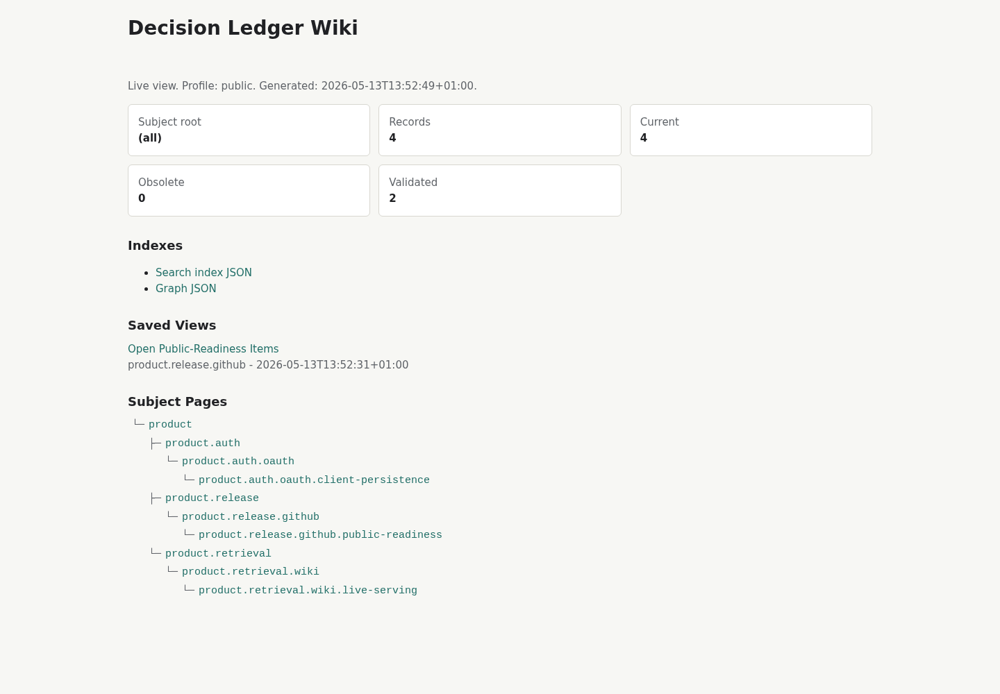
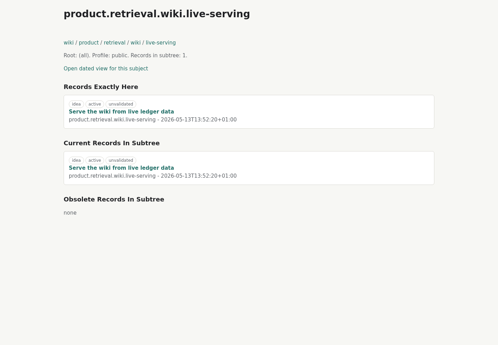
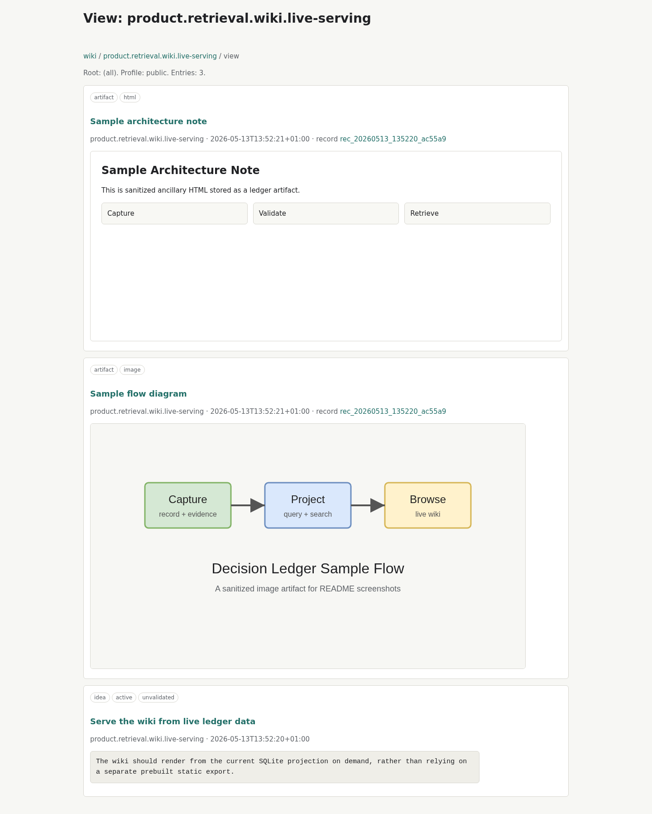
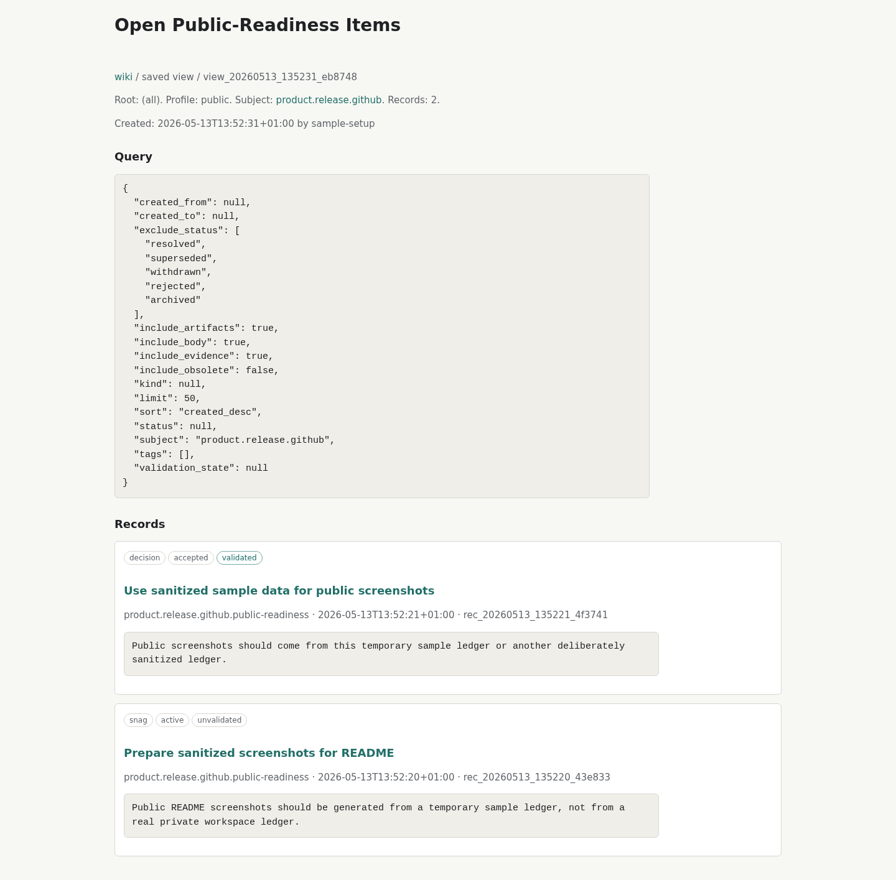

# Decision Ledger

Decision Ledger is a local-first record of thoughts, ideas, snags, decisions,
assumptions, questions, evidence, and associations. It is intended to give
humans and LLM agents a shared, auditable memory that is more precise than
loose markdown, but still easy to browse.

## LLM-Oriented Setup

Decision Ledger is meant to be installed and used by an LLM agent on behalf of
the user. The user should not need to learn the whole CLI or MCP surface before
getting value from it. A good first request is:

```text
Set up Decision Ledger for this workspace. Install it from this repo, create or
reuse a .decision-ledger folder, initialize the ledger, add it to the MCP config
for the LLM clients you can safely edit, test that the MCP server starts, and
serve the live wiki on a free localhost port so I can inspect it.
```

For a repo-local ledger that should be preserved with the project, ask:

```text
Set up a project-local Decision Ledger in ./.decision-ledger. Treat JSONL event
files as canonical and git-friendly, keep ledger.sqlite generated, update
.gitignore if needed, and record the setup decision in the ledger.
```

For a personal top-level ledger shared by several projects, ask:

```text
Set up a Decision Ledger under ~/workspaces/.decision-ledger and configure my LLM
clients to use it by default when working anywhere under ~/workspaces.
```

The LLM should carry out these steps:

1. Create a Python environment and install the repo in editable mode.
2. Choose the ledger home: usually `./.decision-ledger` for a project ledger or
   a higher-level folder such as `~/workspaces/.decision-ledger` for a shared workspace
   ledger.
3. Run `decisions init` against that ledger home.
4. Ensure `events/**/*.jsonl` can be committed and `ledger.sqlite` is treated as
   generated.
5. Configure supported LLM clients, such as Codex or Claude, to start
   `decision-ledger-mcp` with the chosen ledger home or database path.
6. Restart or refresh those clients so the MCP server is visible.
7. Test the setup by listing tools, adding a small record, retrieving it, and
   serving `decision-wiki-server` on a free localhost port.
8. Import any durable decisions, ideas, assumptions, or snag lists already
   buried in markdown, tickets, or planning docs into the ledger.

The underlying commands the agent will usually run are:

```bash
python -m venv .venv
.venv/bin/python -m pip install -e . pytest
./bin/decisions --home ./.decision-ledger init
./bin/decision-wiki-server --home ./.decision-ledger --port 0
```

If the ledger home is shared outside the repo, replace `./.decision-ledger` with
that path. The MCP server can be started with:

```bash
./bin/decision-ledger-mcp --home ./.decision-ledger
```

After setup, useful requests for the user to make are:

```text
Record this as a decision under subject X and attach the relevant files as evidence.
Gather the current context for subject Y before we change anything.
Import the decisions and snags from this markdown plan into the ledger.
Mark decisions under subject X from before 11am as superseded by this new record.
Store this HTML page or screenshot as an artifact under subject Z.
Store this pseudocode as a focused artifact and associate it with requirement X.
Show coverage gaps under subject Y.
Save a reusable view of all open snags and make it appear in the wiki.
Serve the top-level wiki for me on a free localhost port.
```

## Capabilities

- Capture durable records: thoughts, ideas, snags, decisions, assumptions,
  questions, findings, plans, notes, requirements, constraints, test cases, UI
  notes, and interface contracts.
- Organize records in a dot-separated subject tree, so an agent can gather
  context for one namespace or browse all top-level topics.
- Preserve audit history through append-only JSONL events, while using SQLite
  as a generated projection for fast queries.
- Attach evidence to records, including files, URLs, commands, tickets, logs,
  notes, commits, and artifact references.
- Track validation separately from lifecycle status, so a current decision can
  still be marked unvalidated, partially validated, validated, contested, or
  invalidated.
- Supersede or withdraw older records without deleting them, which supports
  "forget this for future reasoning" while retaining the audit trail.
- Associate records across namespaces when a relationship is not captured by
  the subject tree alone.
- Search with lexical and optional local vector retrieval, exposed as one
  hybrid result for agent use.
- Store ancillary artifacts, such as generated HTML explanations, diagrams,
  screenshots, focused snippets, pseudocode, markdown, JSON, YAML, and plain
  text.
- Associate artifacts with records when they verify, constrain, illustrate,
  support, or clarify durable intent.
- Report simple coverage gaps, such as requirements without test cases,
  accepted decisions without evidence, UI notes without artifacts, and
  artifacts without explicit associations.
- Save reusable view definitions and render them live in the wiki from current
  ledger data.
- Serve a live local wiki for browsing subjects, records, evidence,
  associations, artifacts, and saved views.
- Import durable decisions, ideas, assumptions, and snag lists from markdown or
  other planning documents into structured ledger records.

## Screenshots

These screenshots are generated from a sanitized temporary sample ledger.

### Live Wiki Home



### Subject Page



### Subject View With Artifacts



### Saved View



The core idea is:

- Namespace JSONL event files are the canonical store.
- SQLite is a generated projection for fast query, lexical/vector search, and
  wiki serving.
- Records are append-friendly and audit-oriented.
- Dot-separated subjects provide a stable namespace tree.
- Evidence links make claims inspectable.
- Validation state distinguishes checked claims from unvalidated ideas.
- Associations form a graph across records when namespace alone is not enough.
- `decision-wiki-server` makes the live namespace tree browsable on demand.
- Markdown remains a readable projection, not the source of truth.

Durable architecture decisions for this project live in the ledger itself under
the `decision-ledger` subject tree. Browse them with `decision-wiki-server`.

## Target Queries

Examples this project should support:

```text
Forget decisions on product.auth.oauth from before 11am this morning.
Gather all previous thoughts about product.retrieval.wiki.
Show current accepted decisions under product.auth.
Show superseded assumptions that influenced this decision.
Show everything associated with this record, even outside its namespace.
Serve product.auth as a live wiki for review.
```

In this context, "forget" means "exclude from future reasoning by marking as
superseded or withdrawn", not "delete audit history".

## Repository Contents

- [schema/001_initial.sql](schema/001_initial.sql): first-pass SQLite schema.
- [examples/example-record.yaml](examples/example-record.yaml): example record
  with evidence and associations.

## CLI Reference

Initialize a ledger from this repo:

```bash
./bin/decisions init
```

By default this creates or migrates the nearest `.decision-ledger` folder found
by walking upward from the current directory. If none is found, it uses:

```text
~/.decision-ledger/ledger.sqlite
```

Use `--home`, `DECISION_LEDGER_HOME`, `--db`, or `DECISION_LEDGER_DB` for a
different ledger:

```bash
./bin/decisions --home ./.decision-ledger init
./bin/decisions --db /tmp/ledger.sqlite init
```

The canonical git-friendly layout is:

```text
.decision-ledger/
  events/
    product/
      auth/
        oauth/
          client-persistence.jsonl
  ledger.sqlite
```

Commit `events/**/*.jsonl`. Treat `ledger.sqlite` as generated; this repo's
`.gitignore` ignores `*.sqlite`.

CLI and MCP write operations append to `events/<subject path>.jsonl` first, then
apply the same event into SQLite. If `ledger.sqlite` is missing but event files
exist, the projection is rebuilt automatically on startup.

Rebuild the SQLite projection from canonical event files:

```bash
./bin/decisions rebuild
```

`rebuild` also attempts to rebuild the generated vector projection. If Ollama
or `sqlite-vec` is unavailable, the lexical projection still rebuilds and the
result reports vector search as unavailable. Use `--skip-vectors` to avoid the
embedding pass.

Add an idea:

```bash
./bin/decisions add product.auth.oauth.client-persistence \
  --kind idea \
  --summary "OAuth clients should survive service restarts" \
  --body "Idea: client registration data should be stored outside process memory so restart behavior does not lose it." \
  --tag mcp \
  --tag oauth
```

Use `kind=idea` for possible directions that have not yet been chosen. When an
idea becomes the selected direction, create a `kind=decision` record and link or
supersede the idea record if that history will matter later.

Use `kind=snag` for known issues, rough edges, cleanup items, and snag-list
entries that should be retrievable alongside the rest of the audit trail.

Use `kind=requirement`, `kind=constraint`, `kind=test_case`, `kind=ui_note`, and
`kind=interface_contract` when software-project intent benefits from more
specific structure while still remaining a normal ledger record.

Store a self-contained HTML artifact, image artifact, or focused text artifact:

```bash
./bin/decisions artifact add-html product.demos.sample \
  --file ~/Downloads/sample-demo.html \
  --summary "Sample demo HTML" \
  --visibility internal

./bin/decisions artifact add-image product.demos.sample \
  --file ~/Downloads/sample-overview.png \
  --summary "Sample overview diagram" \
  --visibility internal

./bin/decisions artifact add-text product.checkout.requirements.payment \
  --type pseudocode \
  --content "if payment.valid then enable(confirmButton)" \
  --summary "Payment button pseudocode" \
  --visibility internal
```

Artifacts are copied into `.decision-ledger/artifacts/...` and indexed through
JSONL events. HTML artifacts are trusted local/team content; inline CSS and
inline JavaScript are allowed. The live wiki serves artifacts at
`/artifacts/<artifact_id>/content` and links them from the artifact record page.
HTML artifacts are not the persistence mechanism for views; they are ancillary
free-form material attached to ledger subjects or records.

Text/code-like artifacts are for focused snippets, pseudocode, markdown, JSON,
YAML, or plain text when those forms express intent better than prose. They are
not for ingesting full source trees or replacing the filesystem.

Associate a record with an artifact:

```bash
./bin/decisions artifact associate rec_... art_... \
  --relation illustrates \
  --note "This pseudocode illustrates the payment validation requirement"
```

The live wiki also serves dated subject views at
`/views/subjects/<subject/path>/index.html`, mixing records with embedded HTML
and image artifacts from that subtree. Saved views are separate query
definitions persisted through JSONL events into the generated SQLite projection;
they are linked from the wiki front page and rendered live from current ledger
data at `/saved-views/<view_id>.html`.

Set validation state separately from lifecycle status:

```bash
./bin/decisions add product.auth.oauth.client-persistence \
  --kind finding \
  --status active \
  --validation-state partially_validated \
  --summary "Client registrations may be volatile" \
  --body "This has supporting evidence, but has not yet been reproduced end to end."

./bin/decisions validate rec_... \
  --state validated \
  --validated-by alice \
  --note "Confirmed against current database rows and restart logs"
```

`status` is lifecycle/currentness. `validation_state` is epistemic quality:

- `unvalidated`: captured but not checked
- `partially_validated`: some supporting evidence, still incomplete
- `validated`: checked against sufficient evidence for the current use
- `contested`: credible evidence or review challenges it
- `invalidated`: evidence shows it should not be treated as true

Attach evidence:

```bash
./bin/decisions evidence add rec_... \
  --type file \
  --uri /path/to/project/service.py \
  --note "Service source file that implements the behavior"
```

Associate records:

```bash
./bin/decisions associate rec_... rec_... \
  --relation depends_on \
  --note "This auth thought depends on the persistence ownership finding"
```

Gather current context for a namespace:

```bash
./bin/decisions gather product.auth
```

List available topics in the subject tree:

```bash
./bin/decisions topics product.auth --direct
```

Run semantic vector search over ledger records:

```bash
./bin/decisions vector-search "local-first retrieval decisions"
```

Build a mixed subject view from records and artifacts:

```bash
./bin/decisions view product.demos.sample
```

MCP consumers can use `decision_create_view` for a transient filtered view and
`decision_save_view` when a reusable view definition should appear in the wiki.

List open snags without dropping to SQLite:

```bash
./bin/decisions list --kind snag --exclude-status resolved --exclude-status superseded
```

Report simple coverage and consistency gaps:

```bash
./bin/decisions coverage product.checkout
```

Vector search uses the generated SQLite projection, not the canonical JSONL
event files. The default embedding provider is local Ollama:

```text
DECISION_LEDGER_OLLAMA_URL=http://127.0.0.1:11434
DECISION_LEDGER_VECTOR_MODEL=nomic-embed-text:latest
DECISION_LEDGER_VECTOR_DIMENSIONS=768
DECISION_LEDGER_VECTOR_MAX_TEXT_CHARS=8000
```

The embedding text schema is `record_text_v1`, covering subject, kind, status,
validation state, summary, body, tags, and related subjects. Vector metadata is
stored with provider, model, dimensions, text schema, and content hash so stale
rows can be rebuilt. Very large records are capped only for embedding input and
include a truncation marker with the original text hash; the canonical record
body remains in the event store and SQLite record projection.

The MCP-facing `decision_search` tool returns one structured hybrid result:
`combined` fused matches, the raw `lexical` result set, and the raw `vector`
result set or vector-unavailable status. This avoids requiring agents to make
separate lexical and vector calls for normal recall.

Supersede a single record:

```bash
./bin/decisions supersede rec_old rec_new \
  --note "New decision replaces the earlier proposal"
```

Bulk supersede records under a namespace before a timestamp:

```bash
./bin/decisions supersede product.auth.oauth \
  --before "2026-05-07 11:00" \
  --replacement rec_new \
  --note "Earlier records were superseded by the 11am design revision"
```

Commands that support `--json` produce stable machine-readable output for
future agent integration.

Serve a subject subtree as a live wiki:

```bash
./bin/decision-wiki-server decision-ledger \
  --home /path/to/workspace/.decision-ledger \
  --port 8766
```

The wiki server serves each page on demand from the current SQLite projection
instead of prebuilding a static tree. This is the only supported wiki path.

## MCP Server

The repo also includes a dependency-free stdio MCP server:

```bash
./bin/decision-ledger-mcp
```

Use a specific ledger with `--db` or `DECISION_LEDGER_DB`:

```bash
./bin/decision-ledger-mcp --db ~/.decision-ledger/ledger.sqlite
```

Example Codex MCP config:

```toml
[mcp_servers.decision-ledger]
command = "/path/to/decision-ledger/bin/decision-ledger-mcp"
args = ["--home", "/path/to/workspace/.decision-ledger"]
```

The MCP server exposes tools for:

- `decision_guidance`
- `decision_rebuild_projection`
- `decision_add_record`
- `decision_add_evidence`
- `decision_add_html_artifact`
- `decision_add_image_artifact`
- `decision_add_text_artifact`
- `decision_list_artifacts`
- `decision_validate_record`
- `decision_associate_records`
- `decision_associate_artifact`
- `decision_supersede_record`
- `decision_supersede_subject_before`
- `decision_gather`
- `decision_view_subject`
- `decision_query_records`
- `decision_coverage_report`
- `decision_create_view`
- `decision_save_view`
- `decision_list_views`
- `decision_search`
- `decision_vector_search`
- `decision_show_record`
- `decision_list_records`
- `decision_list_topics`

It also exposes prompt templates:

- `decision-ledger-best-practices`
- `capture-decision-context`

The MCP surface deliberately bakes in usage guidance:

- treat namespace JSONL event files as canonical and SQLite as a generated
  projection
- gather current subject context before making durable claims
- prefer current records for reasoning
- keep lifecycle status separate from validation state
- prefer validated records for audit-sensitive factual claims
- label uncertainty when relying on unvalidated or partially validated records
- treat superseded records as audit history unless explicitly requested
- supersede or withdraw records instead of deleting them for normal forgetting
- attach evidence for audit-worthy claims
- associate records across namespaces when subject prefix alone is insufficient
- use focused artifacts for snippets and pseudocode when they express intent
  better than prose, without ingesting whole codebases
- associate artifacts to the records they verify, constrain, illustrate,
  support, or clarify
- use coverage reports to find missing tests, evidence, UI artifacts, or
  artifact associations
- preserve detail rather than shrinking source material, but split multi-decision
  material into linked records when parts need independent subjects, tags,
  evidence, statuses, or supersession paths
- process durable decisions, ideas, and snag lists buried in markdown, tickets,
  transcripts, or repo docs into the subject tree, with the source document as
  evidence
- start `decision-wiki-server` for browsable wiki views
- use `decision_save_view` for reusable saved views; do not store rendered view
  HTML as an HTML artifact
- stay implementation-process agnostic; do not use the ledger to drive builds,
  orchestrate variants, or replace Git/build tooling

The implementation follows the MCP stdio shape: newline-delimited JSON-RPC on
stdin/stdout, no stdout logging, `initialize`, `tools/list`, `tools/call`,
`prompts/list`, and `prompts/get`.
